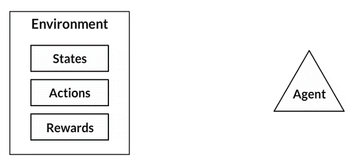

<!--- --->

  

<h6 align="center">
  
</h6>

<h3 align="Justify"> 🤘 I'm an M.Tech Engineering Student of IIT Delhi.</h3>

### 🧐 More About Me:
- 👀 I’m interested in exploring Science  
- 🌱 I’m currently learning and working on Reinforcement Learning

      Coding language : Python | MATLAB | R | GNU Octave
      
      

 

### Let's Connect 🔗

 

<!---
## Publications 
If you find this work useful in the academic context, please consider to cite one of the following papers:
--->
