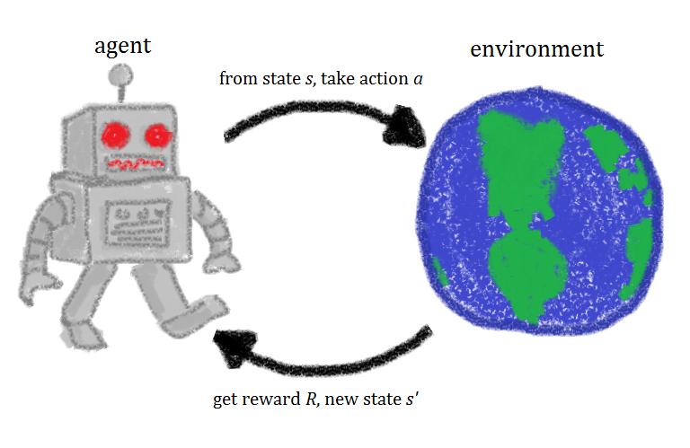

<h6 align="center">
  
</h6>

<h3 align="Justify"> 🤘 I'm an M.Tech Engineering Student from IIT Delhi.</h3>

### 🧐 More About Me:
- 👀 I’m interested in exploring Science  
- 🌱 I’m currently learning and working on Reinforcement Learning
- 📫 How to reach me : rohanthorat2@gmail.com

<!---
rohanthor/rohanthor is a ✨ special ✨ repository because its `README.md` (this file) appears on your GitHub profile.
You can click the Preview link to take a look at your changes.
--->
